<h1>Flapper Nimble+ </h1>
<h3> Specifications</h3>
<table>
  <tr>
    <th>Application</th>
    <td>Research & Education, Entertainment</td>
  </tr>
  <tr>
    <th>Wingspan</th>
    <td>490 mm</td>
  </tr>
  <tr>
    <th>Max. payload</th>
    <td>25 g (body shells, addon sensors, …)</td>
  </tr>
  <tr>
    <th>Weight</th>
    <td>85 g (no battery)</td>
  </tr>
  <tr>
    <td></td>
    <td>102 g (incl. 2S 300 mAh battery)</td>
  </tr>
  <tr>
    <td></td>
    <td>127 g (incl. 2S 300 mAh battery & max. payload)</td>
  </tr>
  <tr>
    <th>Battery</th>
    <td>LiPo 2S 300 mAh</td>
  </tr>
  <tr>
    <th>Flight time</th>
    <td>> 5 minutes (hovering with max payload)</td>
  </tr>
  <tr>
    <th>Actuators</th>
    <td>2 x BL DC motor</td>
  </tr>
  <tr>
    <td></td>
    <td>2 x rotary servo</td>
  </tr>
  <tr>
    <th>Flight control board</th>
    <td>Crazyflie Bolt (Bitcraze SE)</td>
  </tr>
  <tr>
    <th>ESCs</th>
    <td>Open-hardware design by <a href="https://fishpepper.de/projects/tinypepper2/" target="_blank">Simon Schulz / fishpepper.de</a></td>
  </tr>
  <tr>
    <th>Wireless connectivity</th>
    <td>nRF51822 (PC datalink via Crazyradio, Android & iOS App)</td>
  </tr>
  <tr>
    <td></td>
    <td>FrSky receiver (Flight control) [OPTIONAL]</td>
  </tr>
  <tr>
    <th>Flight controller</th>
    <td>Mobile App (Android & iOS devices)</td>
  </tr>
  <tr>
    <td></td>
    <td>2.4 GHz FrSky-compatible transmitter [OPTIONAL]</td>
  </tr>
  <tr>
    <td></td>
    <td>USB/Wireless Gamepad (via PC/Android client)[not included]</td>
  </tr>
  <tr>
    <th>Additional features</th>
    <td>Integrated microSD card slot</td>
  </tr>
  <tr>
    <td></td>
    <td>Interface for WS2812b RGB LEDs (3.8V, max 1000mA)</td>
  </tr>
  <tr>
    <td></td>
    <td>Compatibility with selected decks for Crazyflie 2.0/2.1 (Bitzraze SE) including the Lighthouse and LPS decks</td>
  </tr>
  <tr>
    <th>Expansion connectors</th>
    <td>VCC (3.0V, max 100mA)</td>
  </tr>
  <tr>
    <td></td>
    <td>VCOM (5V, max 400mA)</td>
  </tr>
  <tr>
    <td></td>
    <td>I2C (400kHz)</td>
  </tr>
  <tr>
    <td></td>
    <td>SPI</td>
  </tr>
  <tr>
    <td></td>
    <td>2 x UART</td>
  </tr>
  <tr>
    <td></td>
    <td>4 x GPIO/CS for SPI</td>
  </tr>
  <tr>
    <th>Accessories</th>
    <td>Transport case (460 x 330 x 150 mm)</td>
  </tr>
  <tr>
    <td></td>
    <td>Battery & charger</td>
  </tr>
  <tr>
    <td></td>
    <td>Set of wings</td>
  </tr>
  <tr>
    <td></td>
    <td>Set of spare wear & tear parts</td>
  </tr>
  <tr>
    <td></td>
    <td>Body shells [OPTIONAL]</td>
  </tr>
  <tr>
    <td></td>
    <td>2.4 GHz transmitter [OPTIONAL]</td>
  </tr>
  <tr>
    <td></td>
    <td>Crazyradio PA USB dongle [OPTIONAL]</td>
  </tr>
</table>

In the interests of continuous product improvement all specifications are subject to change without notice.

The latest datasheet can be downloaded <a href="nimbleplus:flapper_nimbleplus_specs_2024-03.pdf">here</a>.

 

 <h3>Components & Accessories</h3>
  
  

    
1. If your Flapper was shipped to you, it arrived with foam inserts. These inserts are not needed for regular transport but it is a good idea to keep them should you ever need to ship the Flapper.

    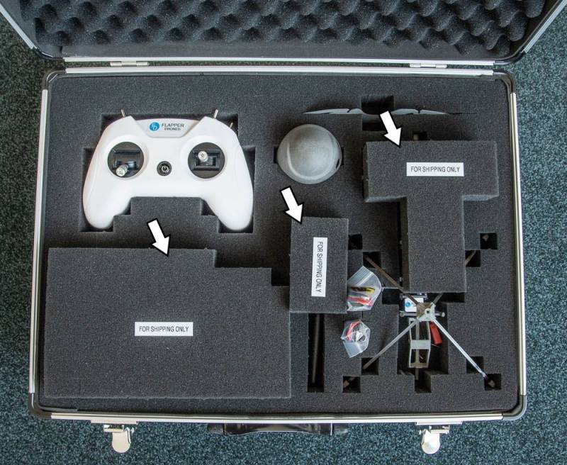
  

  

    
2. The content of the flight case is described below, the exact components might vary depending on the model year. Please note that some of the accessories are optional and thus may have not been included with your Flapper.

    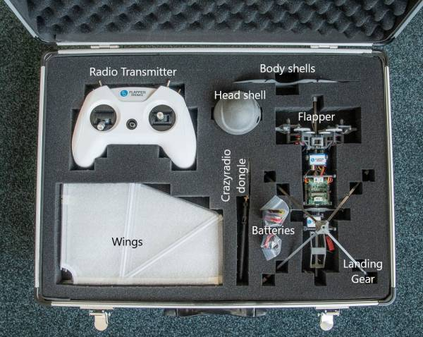
    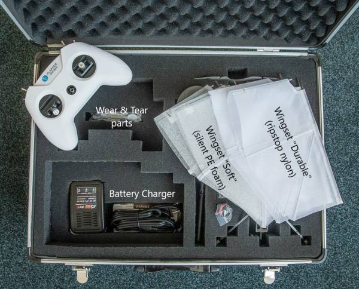
  

 

  <h3>Battery Charging</h3>
  
The batteries are supplied at a 30% state of charge and should be fully charged before their first use. The LED indication on the USB chargers may vary depending on the exact model. Please reach out to us if unsure.

  
  

    
1) Battery is charging:

    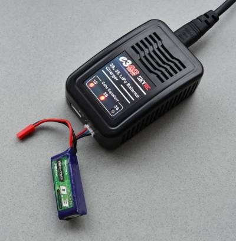
     
    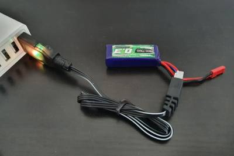
  

  

    
2) Battery is fully charged:

    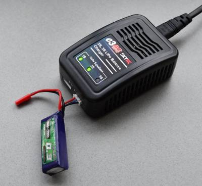
     
    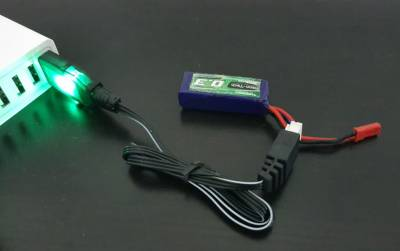
  

  

    
When charging LiPo batteries, <strong>never leave the charger unattended!</strong>

  

  

   

<h2> Pre-flight setup </h2>

  <h3 id = "landing-gear-installation">Landing Gear Installation (Optional)</h3>

  

    
The installation of the landing gear is optional, and is only required if you want to perform take-offs and landings from the ground.

    
<strong>We always recommend it for novice users.</strong>

    
Experienced operators can also launch the Flapper from hand, and catch it by hand at the end of the flight. Flying without the landing gear slightly reduces aerodynamic drag, and makes the Flapper a bit more agile in flight due to lower mass and inertia of this configuration.

  

  

    
1. Install the landing gear by pressing it onto the fuselage as indicated:

    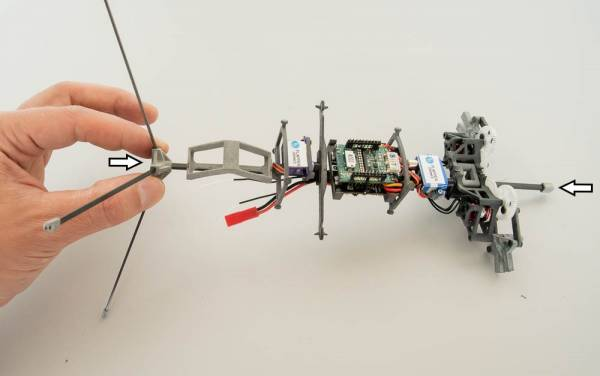
    

      
This step might require quite some force, especially when the Flapper is brand new. If pressing it on with only your hands is too hard, you can place the Flapper upside down and use a desk or another hard surface as a support for the top of the fuselage (indicated with the right arrow on the image above). Perform this carefully such that the Flapper remains vertical and does not slip, otherwise you could damage the Flapper.

    

  

  

    
2. When storing the Flapper in the flight case, remove the landing gear by holding the Flapper at the top and pulling the landing gear down.

  

  
  

   

  <h3 id = "install-wings">Wing Installation</h3>
  
The Flapper is stored in the flight case with the wings detached. To install the wings, follow the steps below:

  
  

    
1. Insert the leading edge rod into the wing arm, pay attention to the orientation.

    

      
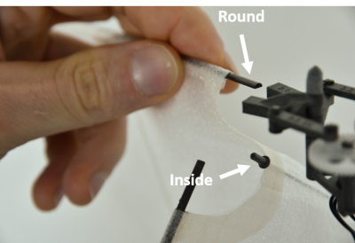

       
      
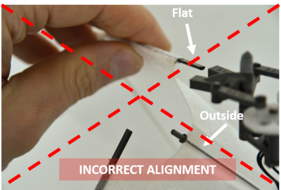

    

    

      
The carbon rod at the root of the wing should be on the <strong>inside</strong> of the wing fold. If the leading edge has a D profile (model year 2022 and older), then also the round side should be facing up.

    

  

  

    
2. Repeat step 1. for the other leading edge rod.

    
  

  

    
3. Insert the wing root rod plug into the indicated cylindrical hole.

    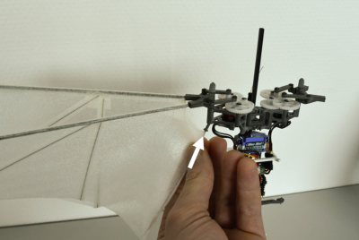
  

  

    
4. Connect the wing root rod to the bottom wing arm.

    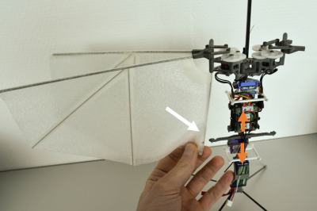
    

      
If needed, move the bottom servo assembly up or down to have a good alignment with the opening on the wing.

    

  

  

    
5. Slide the root rod into the slot.

    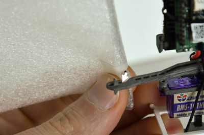
  

  

    
6. Pull the wing gently outwards such that the root rod locks itself at the end of the slot.

    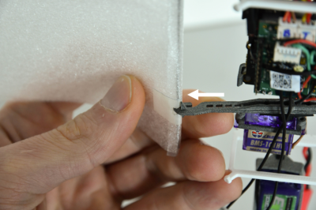
  

  

    
7. Repeat the process for the other wing and you are finished!

    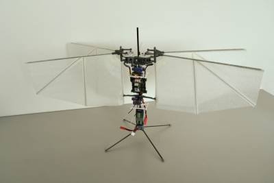
  

  

   

  <h3>Wing De-installation</h3>
  
For storage, or when you need to replace a damaged wing, follow these steps to remove the wings:

  

    
1. Slide the root rod out of the slot in the bottom wing arm.

    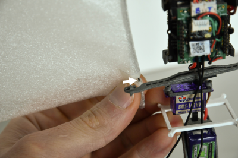
  

  

    
2. Pull the wing root rod plug out of the flapping mechanism.

    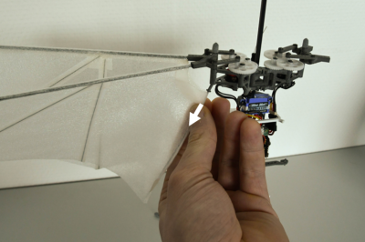
  

  

    

      
Before you start with this step, make sure the wing is fully folded.

    

    
3. Pull <strong>both</strong> of the leading edges <strong>simultaneously</strong> out of the wing arms.

    
Should this require too much force (which can be the case when your Flapper is new), remove them one by one, starting with the looser one, while <strong>paying extra care</strong> not to pull too hard, as otherwise you might tear the wing once the leading edge gets released from the wing arm.

    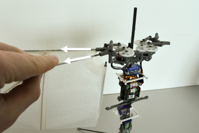
  

  

    
4. Repeat steps 1-3 for the second wing and you are finished.

    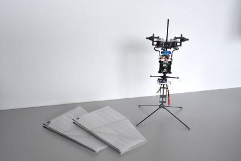
  

 

<h3>Battery Installation</h3>
  
  

    
1. Install the battery by pushing it inside the flexible battery holder as indicated:

    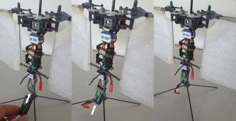
  

  

    
2. Verify that the battery is properly seated and that the bottom "lip" of the battery holder is providing support instead of being bent. Re-seat the battery if necessary.

    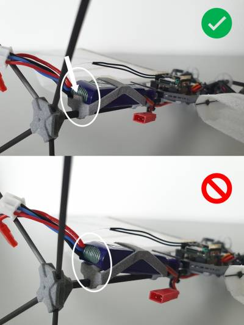
  

  

   

  <h3>Shell Installation (Optional)</h3>
  
  

    
In case you have purchased the Flapper with the optional shells, these are detached from the Flapper when stored in the flight case. The shells are only for aesthetic purposes and the Flapper can be operated without them, e.g. when larger payload capacity is desired or when performing tests which involve higher risk of crashing.

  

  
To install the shells, follow the steps below:

  

    
1. If you wish to use the landing gear <a href=#landing-gear-installation>install it first</a>.

  

  

    
2. Remove the shells from the flight case and get them ready.

    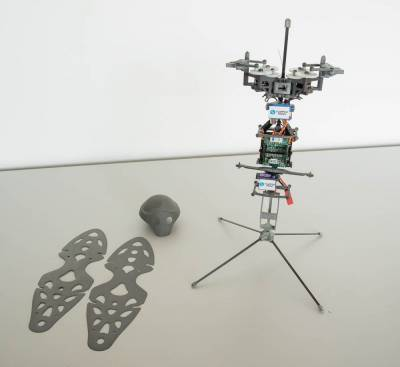
    

      
When handling the shells, proceed with caution! They are designed as lightweight as possible such that the flight performance of the Flapper is not negatively affected. This, however, means they are quite delicate. Handle them with care!

    

  

  

    
3. Take one of the body shells and orient it correctly.

    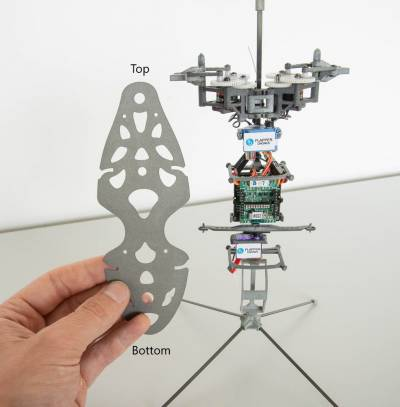
  

  

    
4. The body shells have 4 slots on its side into which the shell holder on the Flapper's body needs to slide in. Start with one of the slots as indicated:

    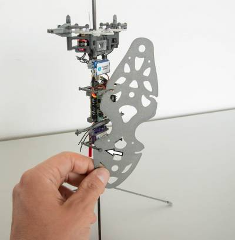
  

  

    
5. Then continue with the second slot on the same side:

    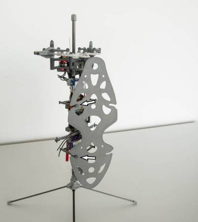
  

  

    
6. To seat the shells properly also on the other side, squeeze the shell gently such that it slightly bends. This will allow you to seat the slot on the shell holder as indicated:

    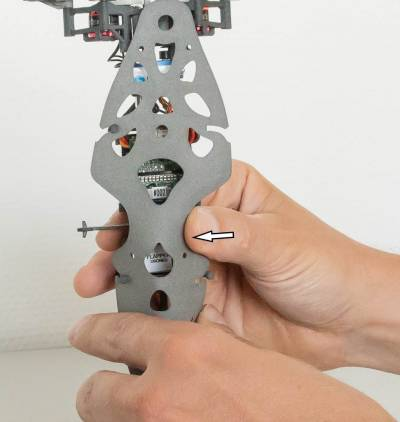
  

  

    
7. Release the pressure that was needed to bend the shell; the holder head should slide into the shell slot.

    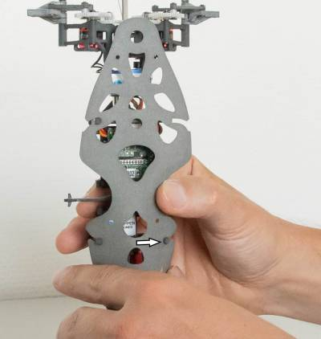
  

  

    
8. Repeat the same to seat the remaining slot:

    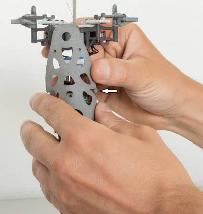
  

  

    
9. The first body shell should be properly seated:

    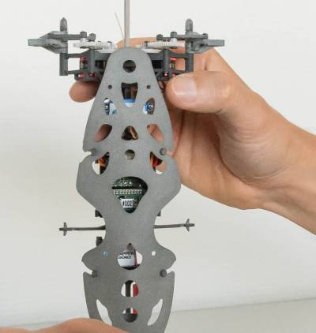
  

  

    
10. Now repeat the same steps and install the second body shell on the other side of the Flapper:

    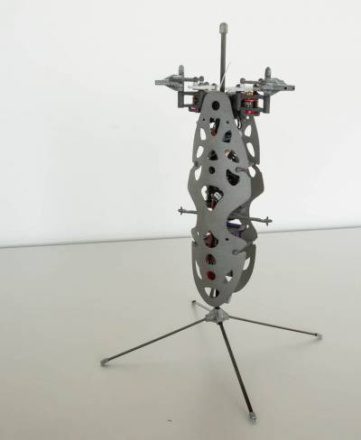
  

  

    
11. Finally, we will install the head shell. It is possible that the top of the fuselage is protected with a cap. In that case, remove this cap first and store it e.g. in the flight case:

    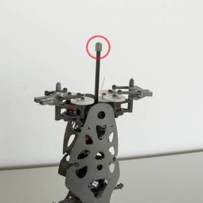
     
    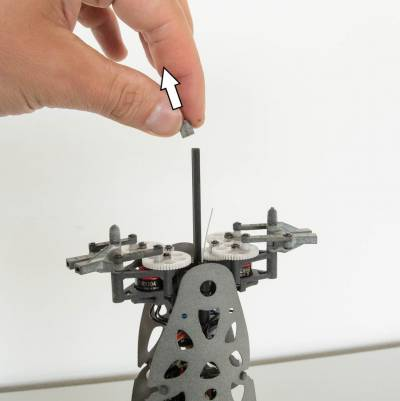
  

  

    
12. Now you can install the head by pressing it on the top of the fuselage. Pay attention to its correct orientation: the eyes of the head should face the front, the fuselage is at the back, as if it was a spine.

    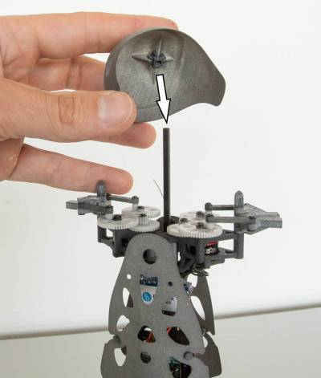
  

  

    
13. Pressing the head on the fuselage might require quite some force. To prevent damaging the head, press on the head right above the fuselage (so slightly towards its back) with one hand. When doing so, either place the Flapper on a hard surface and press against it, or use your second hand and hold the flapper by the bottom of the fuselage, where the landing gear is attached.

    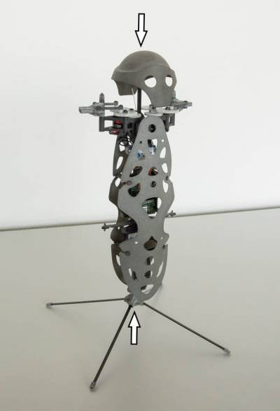
  

  

    
14. The shells are installed! You can go ahead and <a href= #install-wings> install the wings </strong>.

  

  <h3>Body shell removal</h3>

  

    
To remove the shells, follow the installation steps in reverse.

  

  

    

      
To remove the head without any damage, we recommend placing your fingers inside of it as indicated, and then pulling it down while holding the Flappers fuselage next to the battery holder.

    

    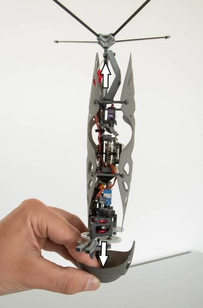
  

 

<h3 id = "power-up-down">Powering the Flapper up & down</h3>

  <h4>Connecting the battery</h4>
  

    
To power the Flapper up, simply plug in its battery.

  

    
<strong>Pay attention to the correct connector orientation</strong>. Using excessive force, it is possible to plug the connector the other way round, which would damage the Flapper's electronics. If unsure, the red and black colors on the lead wires should be matched.

  

  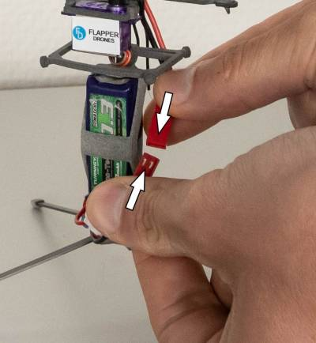

   
Once the battery is connected, place the flapper on a still surface such that its sensors initialize properly. You should hear 3 short beeps, followed by 2 long beeps.

  

    
If you hear only the 3 short beeps and no long beeps, this may indicate the Flapper has been moving too much and its sensors cannot initialize properly. Try to re-plug the battery while keeping the Flapper still.

  
If the startup sequence ends with 1 long beep instead of 2 and you are using a <a href="#radio-transmitter">radio transmitter</a>, check whether your throttle stick is in zero throttle (full down) position.

    

  

  <h4>Disconnecting the battery</h4>
  

    
To power the Flapper down completely, disconnect the battery by pulling the two connector sides apart.

  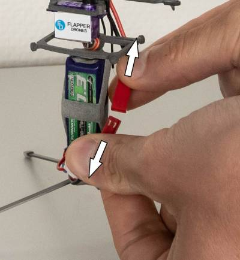

  

      
Disconnecting the battery might require quite some force. If the connector feels to be "stuck", try to be patient and try to loosen it by wiggling the connectors sideways while pulling on both ends. We do not recommend using tools like pliers as this might damage the power leads.

    

  

  <h4>The power switch</h4>
  

    
The control board has a power switch, which can be used for powering the Flapper off and on, e.g. when performing short flight tests with some idle time in between. The power switch is located on the side of the Flapper, a short press will power the Flapper down, another short press will power it up again.

  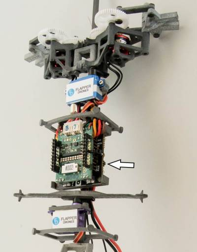

  

      
The power switch will disconnect power going to the motor speed controllers, actuators as well as other add-on devices, limiting the power usage to a minimum. However, the main board will still consume a small amount of power and thus it should only be used when the Flapper is being switched temporarily.

    

  

      
<strong>For storage</strong>, or if you won't be using the Flapper for a longer period of time, <strong>always disconnect the battery from the Flapper!</strong>

  
Otherwise, the small current the main board is using in its idle state will slowly discharge the battery, which will eventually get fully discharged and irreversibly damaged as a result.

    

  

  

   
<!-- -------------------------------------------------------------------------------------------------------------------------------------------------------------------------------------------------------- -->
  <h2> Manual Flight</h2>

  <h3>Smartphone App</h3>
  
Any NimblePlus drone can be flown using a (recent) smartphone with BLE support running Android or iOS.

  

    
If you plan to fly your Flapper manually on a regular basis, we recommend using a dedicated <a href="#radio-transmitter">radio transmitter</a> for the best user experience.

  

  <h3>Default setup (Touch control & BLE)</h3>
  

    
1. Install the Crazyflie app on your smartphone:

    
    
  

  

    
2. Launch the app, and adjust its settings as below:

    
     
    
     
    
     
    
  

  

    
3. <a href=#power-up-down>Power up</a> the Flapper.

    

      
Immediately after the power-up, the Flapper should remain stable such that its on-board sensors initialize correctly.

      
Wait until the drone stops beeping before moving it! You should hear: <strong>3 short beeps --> 2 long beeps</strong>

    

  

  

    
4. Connect the app to the Flapper. You should see console messages appearing once successful.

    
  

  

    
5. The app "sticks" have the following functions (when configured to its default "Mode 2"):

    
  

  

    
6. You are ready for the <a href="flight-first">first flight</a>!

    

      
Never flown a drone before? Check some tutorials first!

      <ul>
        <li><a href="https://dronenodes.com/how-to-fly-a-quadcopter-beginner-guide/">How to Fly a Quadcopter - Beginner Guide</a></li>
        <li><a href="https://youtu.be/P3E2pQnEDRI">Beginner Drone Flying Tutorial</a></li>
      </ul>
    

  

  <h3>Advanced setup</h3>
  <ul>
    <li>To fly faster, you can increase the max roll/pitch values. Be careful as the Flapper might get eventually unstable, but values below 60 degrees will work fine.</li>
    <li>For more precise control, you can connect a gamepad (e.g. for Xbox or Playstation) to your smartphone and select "gamepad" in the settings.</li>
    <li>In the app settings, you can also switch to "gyroscope" control and control the pitch and roll by tilting your phone.</li>
    <li>For longer range, or if you want to fly multiple Flappers at a time, you can connect the <a href="https://www.bitcraze.io/products/crazyradio-pa/">Crazyradio PA USB dongle</a> to your phone via an <a href="https://en.wikipedia.org/wiki/USB_On-The-Go">OTG cable</a> (only supported on Android devices).</li>
  </ul>

  <h2 id = "radio-transmitter">Radio transmitter</h2>

  <h3>Radio transmitter with a Multimodule</h3>
  

    
If you purchased your Flapper as a "Starter Kit", this is the option applicable to you. You can start at item 2.

  

  

    
If you own an Open-TX/Edge-TX transmitter with a 4-in-1 or 5-in-1 multimodule, you should be able to connect to your Flapper even if it does not have a dedicated receiver installed.

  

  

    
Please note that this method remains experimental and further software development is needed to also receive telemetry. If you want a stable long range connection (e.g. to fly outdoors) or telemetry, please consider getting an <a href=#radio-transmitter>external receiver</a>.

  

  

    
1. You will need a specific firmware for the multimodule, which can be downloaded here (stm version, for Jumper T-Lite, T-Pro, ...):

    <a href="multi-stm-1.3.3.25-cflie3.zip">multi-stm-1.3.3.25-cflie3.zip</a>
    
If you need to compile the firmware for another platform, the source code is available in this Github fork:

    <a href="https://github.com/flapper-drones/DIY-Multiprotocol-TX-Module/tree/CFlie_improved">Github Repository</a>
    
Please consult the manual of your transmitter on how to flash the multimodule.

  

  

    
2. <a href=#power-up-down>Power up</a> the Flapper.

  

  

    
3. Push the throttle stick on the transmitter to its full-down position and power the transmitter up.

  

  

    
If you turn the transmitter on first and the Flapper second, the Flapper might get stuck when booting and you will only see blue LEDs blinking rapidly on its flight control board. We have fixed this in the latest multimodule firmware, please reflash your multimodule with the version linked in point 1.

  

  

    
4. Check that the yellow LED on the Crazyflie Bolt flight control board is lit up and blinking rapidly. If it is, you are set and can continue with the <a href=#flight-checks>pre-flight checks</a>.

  

  

    
5. When done flying, first power down the Flapper and then the transmitter.

  

  <h3>Generic radio transmitter (Flapper with an external receiver)</h3>
  

    
If you plan to fly the Flapper manually on a regular basis, we recommend controlling it using a dedicated Radio transmitter and receiver, as it offers the most stable connection and the best user experience.

    
If you have NOT purchased the Flapper with the optional transmitter and receiver already, you can also add a receiver yourself. See <a href=#development-addons>the addon page</a> on how this can be done. This should work with any radio system as long as the receiver can output CPPM. We recommend FrSky R-XSR.

    
The following instructions apply for the transmitter and the on-board receiver that is delivered with the Flapper as an option. The exact model of the transmitter delivered varies depending on the model year of your Flapper. Please consult the provided manual on how to charge and power your transmitter on and off.

  

  

    
1. Push the throttle stick to its full-down position and power up the transmitter.

    
  

  

    
2. <a href=#power-up-down>Power up</a> the Flapper.

  

  

    
3. Check that the LED indicator on the receiver turned yellow (left photo). If it did, you should be set and you can continue with the <a href=#flight-checks>pre-flight checks</a>.

    
    

      
Should you see a blinking red LED instead (middle photo), this indicates a binding problem between the transmitter and the receiver. If you own multiple Flappers, check whether you have not mixed up the transmitters. Otherwise please contact our support and we will help you troubleshoot this.

      
Should you see a blue light, this indicates the receiver is configured to communicate over a wrong protocol. Please press the small button indicated with the orange arrow and hold it for at least 5 seconds, then release. After a few seconds, only the yellow LED should remain on.

    

  

  

    
4. When done flying, first power down the Flapper and then the transmitter.

  

  <h3>PC client & Joystick</h3>
  
To setup a joystick in CFclient, follow these instructions:

  <a href="https://www.bitcraze.io/documentation/repository/crazyflie-clients-python/master/userguides/inputdevices/">CFclient Joystick Setup Instructions</a>
  
As a starting point, we recommend using the following settings that give the most direct response:

  
  

    
While using game console controllers as joysticks is possible, the user experience is not ideal because all their analog axes are typically spring-loaded, including the one for throttle.

    
We recommend using a drone-specific joystick (used for FPV simulators), or a radio transmitter with a joystick functionality support via USB. Wireless USB dongles are also available for many radio systems, allowing to use radio transmitters as joysticks without the need of a cable connection.

  

  

   

  <h3 id = "flight-checks">Pre-flight Checks</h3>
  
Before every flight, perform the following checks:

  

    
1. Check that the wings are correctly installed and that they do not have any damage. If needed, <a href=#servicing>fix the wings</a> or replace them with a new set.

  

  

    
2. <a href=#power-up-down>Power the Flapper up</a>.

  

  

    
3. Check that the servos are correctly trimmed:

    
     
    
    
If they are not (situations indicated with red), perform the <a href=#servo-trim>trimming procedure</a>.

  

  

    
4. Check that all the actuators are working correctly:

    

      
      
(please turn on the close captions to see the instructions)

    

  

  

    
When flying the Flapper, or just testing the actuators, pay attention to the front/back orientation of the Flapper. 
    The "<strong>spine</strong>" (square carbon rod) is on the <strong>back side</strong> of the Flapper.

  

  

    
5. Next, test the auto-stabilization:

    

      
      
(please turn on the close captions to see the instructions)

    

  

  

    
6. You are ready for the <a href=#flight-first>first flight</a>!

  

  

   

  <h3 id = "fiight-first">First Flight</h3>

  

    
If it is the first time you will fly the Flapper, let alone any drone, we recommend doing the first test flights in a <strong>spacious room</strong>, preferably <strong>free of obstacles</strong>. Before the first flights, place the Flapper as far as possible from the walls and other objects. The larger the room, the more relaxed you will be and the faster you will advance, without risking crashes and potential damage to your Flapper.

  

  

    
1. The first time you fly the Flapper, perform a short lift-off and touch down and observe for any drift:

    

      
      
(please turn YouTube close captions on to see the instructions)

    

    
If you observe too much drift in forward/backward direction, you can adjust the pitch <a href=#servo-trim>servo trim</a>.

    
Drift in left/right direction should only be very minor. Larger drift typically means one of the wings is damaged or one of the gearboxes/flapping mechanisms is not operating correctly.

  

  

    
2. Finally, carefully check that all 4 control inputs respond correctly:

    

      
      
(please turn YouTube close captions on to see the instructions)

    

  

  

    
3. The Flapper is ready for more acrobatic flights, have fun!

  

 

<h3 id = "servicing">Servicing</h3>

  <h4>Wing damage</h4>
  
It is possible, that after some crashes, the wings of your Flapper will start to see some damage, such as holes or tears in the wing material, or even broken stiffeners. While the Flapper can fly even with severely damaged wings, fixing any damage as soon as possible is recommended as especially the holes and tears will get larger with operation time.

  
Should you observe any holes or tears in the wing material, patch these with a lightweight, flexible tape. Since 2023, a wing repair tape is included with every Flapper. Otherwise, we recommend the Blenderm surgical tape from 3M.

  
Should one of the wing stiffeners be broken, you can fix it with a splint made of 0.5 mm round CFRP rod, which extends about 2 cm on both sides from the fracture point.

  
Should the wing become irreparable, you can order spare wings from us.

  <h4>Lubrication</h4>
  
Should you start noticing decreased flight performance (reduced flight time, uneven thrust of the left- and right-wing pair), you might need to lubricate the axles at the indicated locations. Do not overlubricate as this could attract dirt, a little drop is more than enough.

  

    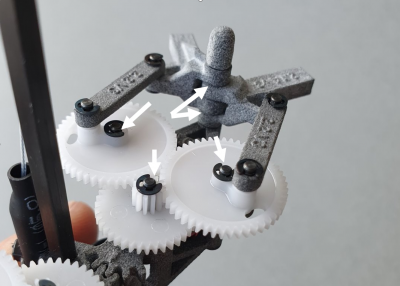
  

  
For optimal performance, use a plastic-safe gear lubricant such as the <a href="https://labelle-lubricants.com/shop/labelle-102-is-an-extremely-versatite-gear-lubricant/" target="_blank">Labelle 102</a>, in EU available e.g. <a href="https://micro-modele.fr/en/lubrifiants/4758-lubrification-engrenages-en-plastique.html" target="_blank">here</a>. Any medium viscosity general purpose silicone oil should be fine. If possible, select one that is marketed as plastic-safe. Do not use mineral oils as those might weaken the plastic parts.

  

   

  <h2>Advanced setup</h2>

  <h5>Crazyflie Ecosystem Documentation</h5>
  
  
The Flapper Nimble+ is powered by the <a href="https://www.bitcraze.io/products/crazyflie-bolt-1-1/" target="_blank">Crazyflie Bolt</a> flight controller, produced by <a href="https://www.bitcraze.io/" target="_blank">Bitcraze AB</a>. It is thus compatible with the Crazyflie software and to some extent also the Crazyflie hardware ecosystem.

  
To learn more about the Crazyflie project, check the following documentation resources:

  <ul>
    <li><a href="https://www.bitcraze.io/documentation/system/" target="_blank">Crazyflie ecosystem overview</a></li>
    <li><a href="https://www.bitcraze.io/documentation/repository/" target="_blank">Crazyflie software repository overview</a></li>
  </ul>

  

   

  <h3>Cfclient Installation</h3>
  
  
Cfclient is a PC application with a GUI that allows you to set the basic parameters, plot and log telemetry signals, and even control the Flapper directly with a joystick, or autonomously using one of the supported positioning systems.

  
If your Flapper is using the latest firmware, install the Cfclient according to the <a href="https://www.bitcraze.io/documentation/repository/crazyflie-clients-python/master/installation/install/" target="_blank">instructions</a> from its main developer, Bitcraze SE.

  
For instructions on how to use the Cfclient, consult the <a href="https://www.bitcraze.io/documentation/repository/crazyflie-clients-python/master/" target="_blank">documentation on the website of Bitcraze</a>.

  
  

    We recommend updating to the latest firmware and following the instructions above. If for some reason you cannot, or do not want to, update the firmware to at least <a href="https://github.com/flapper-drones/crazyflie-firmware/commit/2eb461fbffe8ad79df753206821dc2b6c64553c8" target="_blank">this commit</a>, <strong>only then</strong> please follow the <a href="nimbleplus:client-install-legacy" target="_blank">legacy instructions</a>.
  

  
  

 

<h3 id = "servo-trim">Servo Trimming</h3>
  
  

    Because the neutral position of each servoactuator is slightly different, servo trim needs to be set for each Flapper individually. The servo trim is already set in production, however, you might need to redo this step if you notice that the Flapper tends to fly forward or backward even at zero pitch input, or tends to rotate left or right. This can happen, if the servos get a big hit due to a crash. You will also need to follow this procedure if you replace the servos or the flight control board, or in some cases after a firmware upgrade.
  

  
  
To set the servo trim, you need to have the <a href="client-install" target="_blank">Client application installed</a> on your PC and you will also need the <a href="https://www.bitcraze.io/products/crazyradio-pa/" target="_blank">Crazyradio PA USB dongle</a>.

  
  

    This guide assumes your Flapper is running the latest firmware. For very old firmware versions, if upgrading to the latest firmware is not desirable, please follow the <a href="servo-trim-legacy" target="_blank">legacy instructions</a> instead.
  

  

    1. Launch the Cflient, e.g. by opening your Terminal/Power Shell and typing:
    <pre>cfclient</pre>
    Make sure your Crazyradio PA dongle is connected before starting the Client.
  

  

    2. Connect to the Flapper by clicking "Scan" (1), selecting the interface <code>radio://...</code> from the drop-down menu (2) and clicking "Connect" (3):
     
    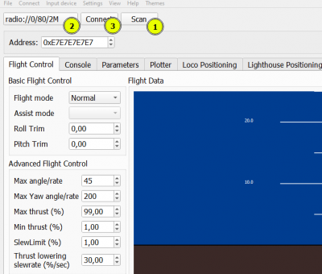
     
  

  

    3. Go to the Parameters Tab (1) and open the "flapper" ("_flapper" in older firmware versions) parameter group (2) to adjust the values of the servo-trims. "servPitchNeutr" corresponds to the pitch (top) servo (3). The value represents the percentage of the servo stroke, and is set to 50% by default. It may have already been set to a different value at the factory. Typically, you should only need to adjust this value by a few percent, but a range of 25% to 75% is allowed.
     
    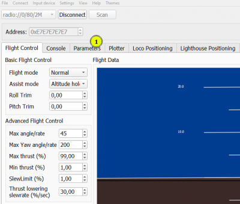
     
  

  

    If you do not see the "Parameters" tab, you can enable it in the main menu ("View" --> "Tabs")
  

   
  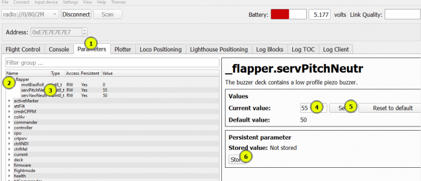
   
  
  

    Keep adjusting the pitch servo trim by typing a new value (4) and clicking Set (5) until the wing leading edges are aligned:
    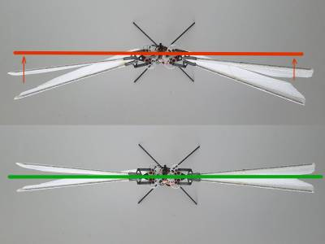
     
    Finally, click on Store (6) to save this value permanently and make sure the new stored value is displayed. You might need to clear the previously stored value first. Now the Flapper will use the stored value also after reboot (power-off --> power on).
     
    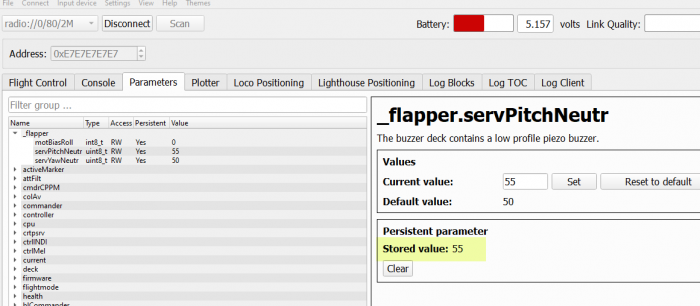
     
  

  

    4. Follow the same procedure and adjust the yaw servo trim value "servYawNeutr" until the yaw arm is aligned with the servo housing. Do not forget to store the final value!
     
    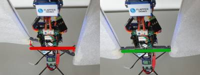
     
  

